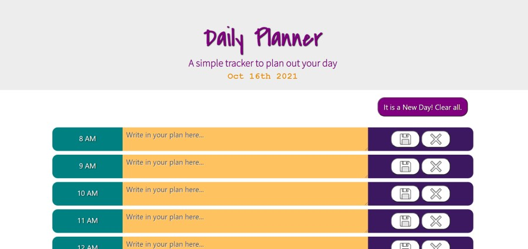

# Daily Planner

Week 5 Homework

## Description

Create a simple work day calendar which shows normal business hours. The user should be able to add content to each hour block and save it to local storage to keep track of their day. When they open the page, the current day's date should display at the top of the page. Additionally, the time blocks should be color coded to represent past, present, and future. For this application, the color coding is on the column with the time of day display. 

## Languages
- HTML
- CSS
- JS

With Help From
- Jquery
- Bootstrap

## Link to GitHub main project page

[Project Page on GitHub](https://github.com/m-sherrill/work-day-planner)

## Link to Deployed Application

[Live Deployed Link](https://m-sherrill.github.io/work-day-planner/)

## Screenshots of Finished Product

## Contact Information

Github: [@m-sherrill](https://github.com/m-sherrill)

Email: mo.sherrill@outlook.com